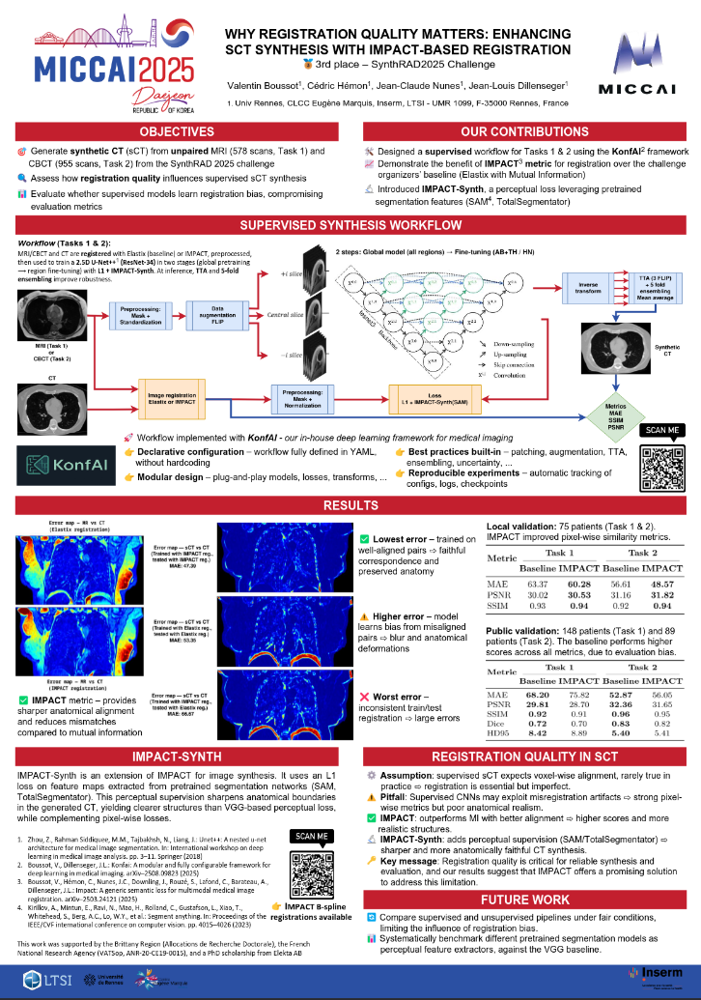

[](https://synthrad2025.grand-challenge.org/) [](https://huggingface.co/VBoussot/Synthrad2025) [](./MICCAI_POSTER.pdf) [](https://arxiv.org/abs/2510.21358) 
[](https://huggingface.co/datasets/VBoussot/synthrad2025-impact-registration)


# SynthRAD2025 – Task 1 (🥉 3rd place)

This repository provides everything needed to build the Docker image and reproduce our solution ranked **3rd** in the **SynthRAD 2025 – Task 1** challenge on synthetic CT generation from MRI.

Our approach is based on a **2.5D U-Net++** with a ResNet-34 encoder, trained in two phases:
- Phase 1: joint pretraining on all anatomical regions (AB, TH, HN)
- Phase 2: fine-tuning separately on **AB-TH** and **HN**

The method was implemented using [KonfAI](https://github.com/vboussot/KonfAI), our modular deep learning framework. Training combines pixel-wise L1 loss with **perceptual losses** derived from **SAM** features.

Final predictions use **test-time augmentation** and **5-fold ensembling**, with a total of **10 models**:  
**5 trained for Abdomen/Thorax (AB-TH)** and **5 for Head & Neck (HN)**.  
Models were selected based on validation MAE.

🏆 **3rd place overall**
(Related leaderboard: [SynthRAD Task 1 leaderboard](https://synthrad2025.grand-challenge.org/evaluation/test-task-1-mri/leaderboard/))

| Rank | MAE ↓             | PSNR ↑            | MS-SSIM ↑        | DICE ↑           | HD95 ↓           | Dose MAE photon ↓ | Dose MAE proton ↓ | DVH error photon ↓ | DVH error proton ↓ | GPR 2mm/2% photon ↑ | GPR 2mm/2% proton ↑ |
|------|-------------------|-------------------|------------------|------------------|------------------|-------------------|-------------------|---------------------|---------------------|----------------------|----------------------|
| 3    | 67.241 ± 22.874 (3)| 29.957 ± 2.658 (2)| 0.935 ± 0.046 (2)| 0.737 ± 0.117 (4)| 7.512 ± 4.070 (4)| 0.006 ± 0.009 (3) | 0.027 ± 0.067 (5) | 0.013 ± 0.031 (3)   | 0.067 ± 0.031 (3)   | 98.880 ± 4.556 (1)   | 82.191 ± 10.164 (3)  |

---

## 📐 Registration (IMPACT vs Baseline)

Accurate sCT synthesis depends on good **inter-modal alignment**. We provide **precomputed IMPACT registrations** (MR↔CT and CBCT↔CT) to ensure consistent training/evaluation.

### IMPACT setup used in this work
The following IMPACT configuration was used for **Task 1 (MR→CT synthesis)**:
- **Feature extractor:** TS/M730  
- **Layers:** 7-Layers (**high-level features**)  
- **Mode:** **Static** + **MIND**  
- **Multi-resolution:** 3-level pyramid  
- **Final B-spline grid spacing:** **10 mm**

### Why it matters

- 🧭 **Alignment quality drives supervised sCT performance**
- 🧩 **IMPACT** → better anatomical alignment than **Elastix-MI**
  - Local set (75 pts): **MAE 63.37 → 60.28 HU**, ↑ PSNR / ↑ SSIM  
  - Sharper, more realistic CTs
- 📊 Public set (148 pts): **Elastix-MI lower MAE (68.20 vs 75.82 HU)**  
  → due to **pipeline bias** (leaderboard uses Elastix registrations)


### Get the registrations
- 👉 **Hugging Face (prealigned pairs):** https://huggingface.co/datasets/VBoussot/synthrad2025-impact-registration

---

## 🚀 Inference instructions

### 1. Install KonfAI

```bash
pip install konfai
```

---

### 2. Download pretrained weights

Download the pretrained models from Hugging Face:

👉 https://huggingface.co/VBoussot/Synthrad2025

You should obtain:

```
Task_1/
├── AB-TH/
│   ├── CV_0.pt
│   ├── CV_1.pt
│   ├── CV_2.pt
│   ├── CV_3.pt
│   ├── CV_4.pt
│   └── Prediction.yml
│
└── HN/
    ├── CV_0.pt
    ├── CV_1.pt
    ├── CV_2.pt
    ├── CV_3.pt
    ├── CV_4.pt
    └── Prediction.yml
```

---

### 3. Dataset structure

Your dataset should be structured as follows:

```
./Dataset/
├── AB/
│   ├── 1ABA002/
│   │   ├── MR.mha
│   │   └── MASK.mha
│   ├── 1ABA003/
│   │   ├── MR.mha
│   │   └── MASK.mha
│   └── ...
├── TH/
│   └── ...
├── HN/
│   ├── 1HNA001/
│   │   ├── MR.mha
│   │   └── MASK.mha
│   └── ...
```

## Required Folder Structure Before Inference

Your directory must look like this:

    .
    ├── Dataset/
    ├── Task_1/
    ├── UNetpp.py
    ├── UnNormalize.py
    └── Prediction.yml

Copy `UNetpp.py` and `UnNormalize.py` from:

    KonfAI/UNetpp.py 
    KonfAI/UnNormalize.py 
    
Copy `Prediction.yml` from:

    Task_1/AB-TH/Prediction.yml

(Use the HN version if running Head & Neck.)

### 3. Run inference (AB-TH example)

```bash
konfai PREDICTION -y --gpu 0 \
  --models Task_1/AB-TH/CV_0.pt Task_1/AB-TH/CV_1.pt Task_1/AB-TH/CV_2.pt Task_1/AB-TH/CV_3.pt Task_1/AB-TH/CV_4.pt
```

For **HN**, replace the path accordingly:

```bash
--models Task_1/HN/CV_0.pt Task_1/HN/CV_1.pt Task_1/HN/CV_2.pt Task_1/HN/CV_3.pt Task_1/HN/CV_4.pt
```

---
## 🛠️ How to Reproduce Training

Training is performed in **two phases**:

---

### 🔹 Phase 1 — Pretraining on all regions

Train a generic model on the full dataset (AB, TH, HN combined) (Fold 0 example):

```bash
konfai TRAIN -y --gpu 0 --config KonfAI/Plan/Phase_1/Config0.yml
```

---

### 🔹 Phase 2 — Region-specific fine-tuning

Fine-tune the Phase 1 model separately for each anatomical region.

#### Abdomen/Thorax (AB-TH) — Fold 0 example:

```bash
konfai RESUME -y --gpu 0 \
  --config KonfAI/Plan/Phase_2/AB-TH/Config0.yml \
  --MODEL Phase1.pt
```

#### Head & Neck (HN) — Fold 0 example:

```bash
konfai RESUME -y --gpu 0 \
  --config KonfAI/Plan/Phase_2/HN/Config0.yml \
  --MODEL Phase1.pt
```

> Replace `Phase1.pt` with the checkpoint from Phase 1 (best model from Fold 0).

## 📌 Poster presented at MICCAI 2025, Daejeon

[](./MICCAI_POSTER.pdf)
